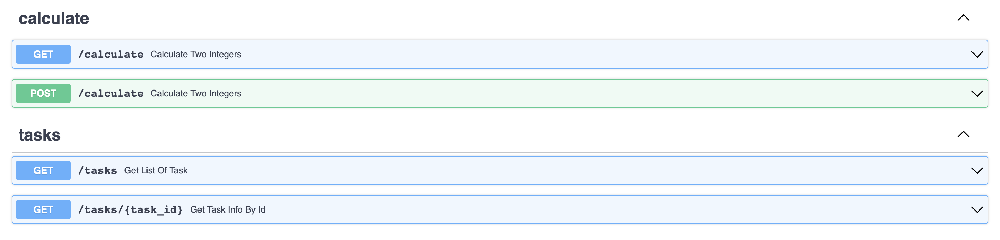
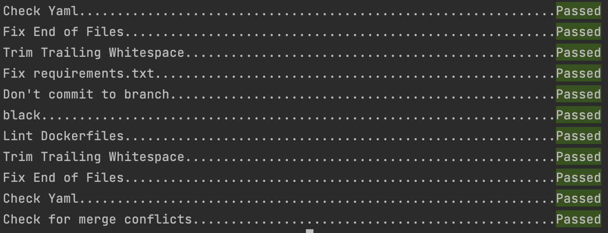
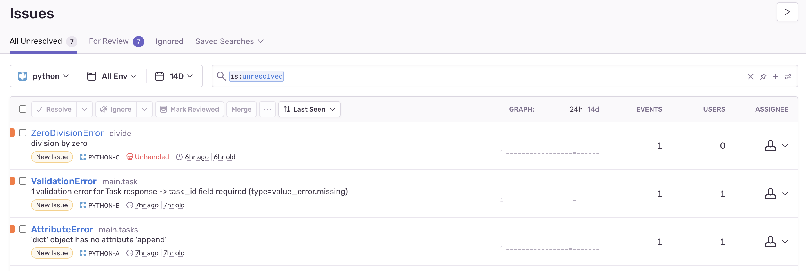

# Asynchronous Calculate Tasks with FastAPI and Celery

Test of how to handle background processes with FastAPI, Celery, and Docker.

## How to run?

Set up the containers:

```sh
$ docker-compose up -d --build
```

Open your browser to [http://localhost/docs](http://localhost/docs) to view docs



Trigger a new task:

```sh
$ curl http://localhost/calculate -H "Content-Type: application/json" --data '{"x": 1, "y": 1, "operation": "+"}'
```

Check the status:

```sh
$ curl http://localhost/tasks/<TASK_ID>
```

Get list of all tasks:

```sh
$ curl http://localhost/tasks/
```


## Pre-commit

You need to check the code before committing. Install pre-commit and add as a hook:

```sh
$ pip install pre-commit
$ pre-commit install
```

Run manually:

```sh
$ pre-commit run --all-files
```



## Sentry



configure sentry dsn in .env file

```
SENTRY_DSN=https://***.ingest.sentry.io/***
SENTRY_ENV=env
```
